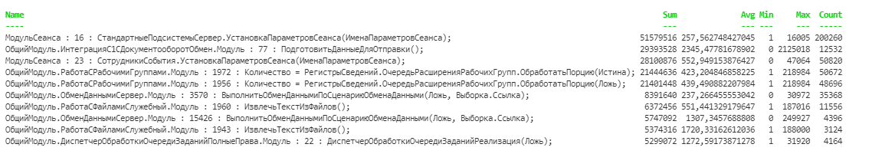

# OneSTools.PS.TechLog


PowerShell commandlet for parsing of 1C technological log.  

This module includes `Get-TechLog` cmdlet and `Group-Techlog` function. `Get-TechLog` provides single parameter (`Path`) that's typed of array of strings. This property works like a *Path* property in *Get-Item* cmdlet and can include wildcard chars as well. Parsed event (`TjEvent` class) already contains commonly used properties that can be used without additional parsing actions from user side. All available properties can be found here: [TjEvent](https://github.com/akpaevj/OneSTools.PS.TechLog/blob/master/TjEvent.cs). `Group-TechLog` is just a function that can be used for grouping and getting aggregated values (sum, avg, count, min, max) by any numerable property.

## Get-TechLog
### Properties
- **Path** - array of paths (can include wildcard chars)

## Group-TechLog
### Properties
- **GroupProperty** - `TjEvent` property name that will be used for grouping  
- **AggregationProperty** - `TjEvent` property name that will be used for calculating aggregated values

## Installation

```powershell
Install-Module OneSTools.PS.TechLog
```

## Usage example
Calculating sum of duration and grouping by the first line of "Context" property:
```powershell
Get-TechLog "C:\techlog\*\*.log" |
Group-TechLog -GroupProperty FirstContextLine -AggregationProperty Duration | 
Sort-Object Sum -Descending | 
Select-Object -First 10 |
Format-Table -AutoSize
```
Example of output:


