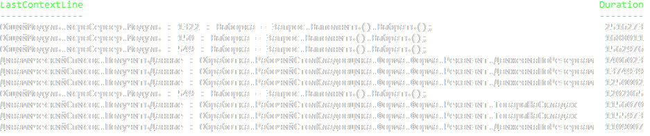
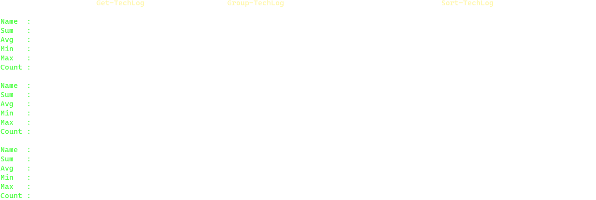

# OneSTools.PS.TechLog

[](https://www.powershellgallery.com/packages/OneSTools.PS.TechLog)

PowerShell commandlet for parsing of 1C technological log.  

This module includes `Get-TechLog` cmdlet and `Group-TechLog` function. `Get-TechLog` provides single parameter (`Path`) that's typed of array of strings. This property works like a *Path* property in *Get-Item* cmdlet and can include wildcard chars as well. Parsed event (`TjEvent` class) already contains commonly used properties that can be used without additional parsing actions from user side. All available properties can be found here: [TjEvent](https://github.com/akpaevj/OneSTools.PS.TechLog/blob/master/TjEvent.cs). `Sort-TechLog` is a function that can be used for sorting of input collection with no increasing memory (unlike `Sort-Object` function). `Group-TechLog` is just a function that can be used for grouping and getting aggregated values (sum, avg, count, min, max) by any numerable property.

# Installation
```powershell
Install-Module OneSTools.PS.TechLog
```

# Get-TechLog
### Properties
- **Path** - array of paths (can include wildcard chars)  
### Example:
```powershell
Get-TechLog "C:\techlog\*\*.log"
```

# Sort-TechLog
### Properties
- **Property** - `TjEvent` property name that will be used for sorting
- **Top** - `TjEvent` elements quantity should be taken 
- **Descending** - Indicates that Sort-TechLog sorts the objects in descending order. The default is ascending order.
### Example:
```powershell
Get-TechLog C:\techlog\*\*.log | 
Where-Object LastContextLine -NE "" | 
Sort-TechLog Duration -Descending -Top 10 | 
Select-Object LastContextLine,Duration | 
Format-Table -AutoSize
```
### Output:


# Group-TechLog
### Properties
- **GroupProperty (alias - GP)** - `TjEvent` property name that will be used for grouping  
- **AggregationProperty (alias - AP)** - `TjEvent` property name that will be used for calculating aggregated values
### Example:
```powershell
Get-TechLog C:\techlog\*\*.log | 
Group-TechLog -GP EventName -AP Duration | 
Format-Table -AutoSize
```
### Output:


### Output (no-format):

